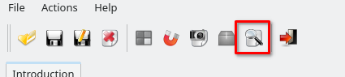

# Kautham demos

The purpose of this repository is to propose a Kautham project structure that guarantees it can be opened using the Kautham GUI and the KTMPB ROS package. The recommended use is to **copy** this repository in the user's own workspace, and follow its structure by editing and adding their own files. 

**FOLLOWING THIS STRUCTURE IS OPTIONAL BUT RECOMMENDED**. It is possible to use models and other files from different paths in Kautham, but following this repository structure requires the least work and ensures compatibility. 

There is **no** Kautham code in this repository, and it requires no installation of any kind. 


## Directory structure

The recommended Kautham project structure is the following: 

your_kautham_project
├── models
│   ├── robots
│   └── obstacles
└── your_scenarios_folder
    ├── singular_scenario_folder_a (e.g. YuMi tabletop)
    ├── singular_scenario_folder_b (e.g. Tiago Kitchen)
    └── ...
    


- **`your_kautham_project/`**  
  This is the root folder containing all files related to your Kautham project.  

  - **`models/`**  

    Inside this folder, you can organize models for robots and obstacles however you like, as long as any `.urdf` and `.xacro` files reference the correct relative paths.  

    For detailed recommendations on structuring and referencing model files, see [these instructions](your_kautham_project/models/README.md).

    To access the `obstacles/` or `robots/` subfolder from the Kautham Problem files, follow the structure `/[obstacles or robots]/[rest_of_the_path].[urdf or xacro]`. In the Kautham Problem File, it should look like this:

    ```xml
	<Obstacle obstacle="/obstacles/3D-environments/kitchen/kitchen.urdf" scale="1">
		<KauthamName name="kitchen" />
		<Home TH="0.0" WZ="0.0" WY="0.0" WX="0.0" Z="0.0" Y="0.0" X="0.0" />
	</Obstacle>
    ```

    This repository includes a selection of the models and robots that are used for the Kautham demos. The user is encouraged to add their own to add complexity and variety beyond the demo scenarios.


  - **`your_scenarios_folder/`**  
    This folder contains one or more subfolders, each representing a distinct scenario in Kautham. A scenario folder defines a specific setup, including its configuration and Kautham Problem files.

    It is recommended (though not strictly required) to create a separate scenario folder for each unique combination of robot and environment. Within a scenario, you can include multiple Kautham Problem files to represent different configurations or queries — for example, adding new objects (like a can) or using alternative control files.


## Usage

To open the problem files:

- Open the Kautham GUI with `kautham-gui`

- Select File>Open

- Find your scenario folder, and select the appropiate Kautham Problem file.

- If the models are not found, add the models folder into the GUI:

    


## Note on available demos

Not all the demos [available in Kautham](https://github.com/iocroblab/kautham/tree/master/demos) have been transfered to this package and ensured their compatibility. Small adaptations to the Kautham Problem file may be needed if they are copied directly to this structure. **The scenarios included in this repository have been checked to work directly**. 

## Troubleshooting


If in the ETSEIB computer and you have trouble opening .xacro files, make sure that ROS2 has been sourced.